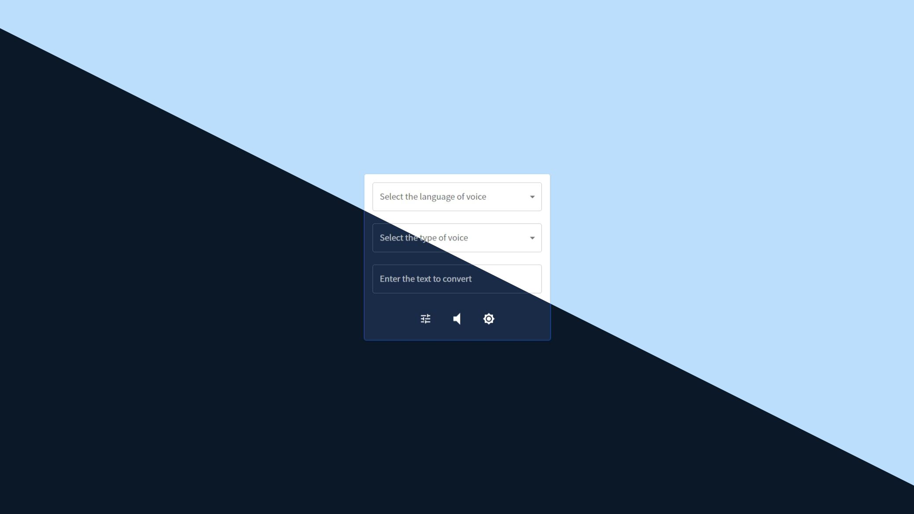
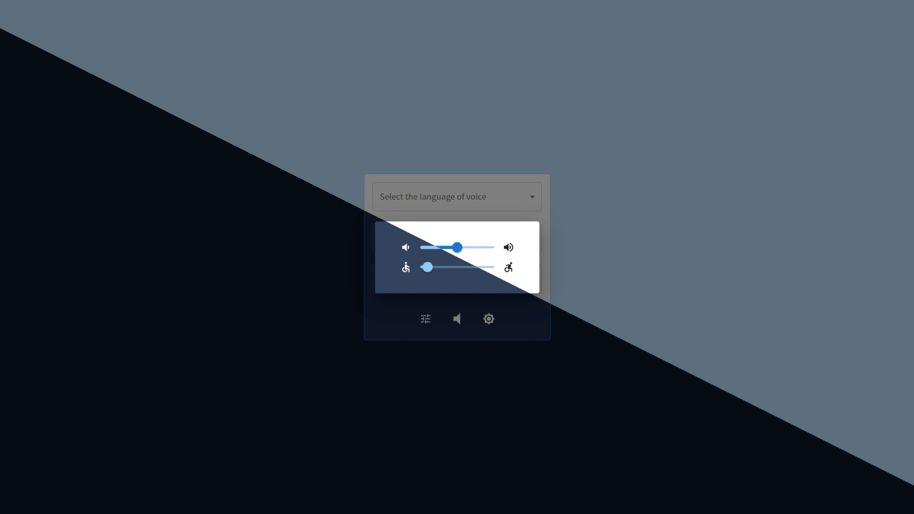

# Text2Voice
Using The `SpeechSynthesisVoice` interface of the Web Speech API, Converting text to speech.

Demo: [https://sky9154.com/Text2Voice/](https://sky9154.com/Text2Voice/)

* Main Display

* Setting Dialog

## Functions
* The menu be used to select language and type of the voice.
* The slider be used to updata volume and rate values.

## Reference
* [SpeechSynthesisUtterance](https://developer.mozilla.org/en-US/docs/Web/API/SpeechSynthesisUtterance)
* [SpeechSynthesis](https://developer.mozilla.org/en-US/docs/Web/API/SpeechSynthesis)
* [Getting the list of voices in speechSynthesis (Web Speech API)](https://stackoverflow.com/questions/21513706/getting-the-list-of-voices-in-speechsynthesis-web-speech-api)